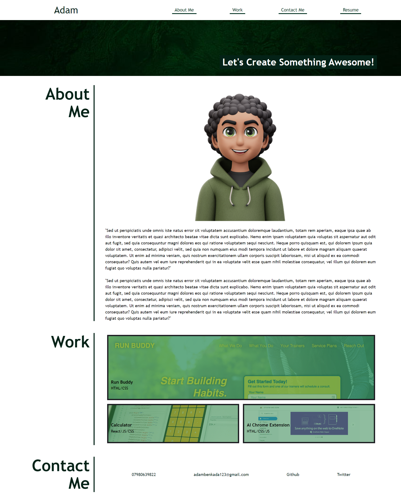

# Building a Portfolio From Scratch

## Description:

I built this project to display my portfolio using advanced CSS skills such as flexbox layouts, media queries and hover animations. This is designed to showcase my ability to apply the knowledge learnt throughout the bootcamp into a well-structured deployed website, in only a short time.

## Deployed Link:

https://adam-portfolio-eight.vercel.app/ 

## License 

Copyright (c). All rights reserved.

Licensed under the MIT license.
